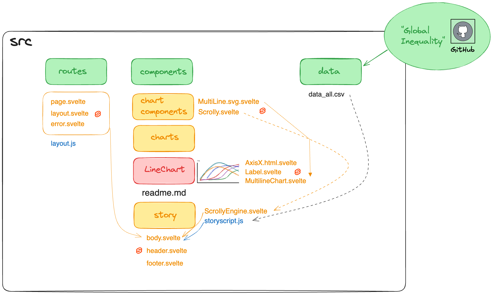

# Global inequality

This is a data driven project about global inequality.

Please find the intro for the porject [here](https://github.com/sandravizz/Intro-Global-Inequality).
Please find the EDA that uses the output data files from this repository in this [notebook](https://observablehq.com/@sandraviz/global-inequality) and this [notebook](https://observablehq.com/d/b8a01ac60f823d87).

The project is split into two Github repository. This one is called "Global inequality" is used for data loading and warngling. The output is the input for the second one repository called gini, which is used for the web-page and visualisations unsing svelte, layercake and d3.js.

## Background

Something isn't going well in current, modern, western societies. I feel it, my friends feel it, people around us and in the world are struggeling. More and more do we hear about our democracies failing, our communities splitting and inequalities rising.

In order to invesitgate about this preceived development Patrick and I decided to have a deeper and as it turns out a very deep look at data about global inequality.

## Data

Using data from the [World Inequality Database (WID)](https://wid.world/) we use mainly the js library [arquero](https://www.npmjs.com/package/arquero) to load, join and transform data. The objective of this project is to investigate the reasons and consequences of a rising global inequality.

## Loading.js

In these scripts all individual country files are loaded in order to combine them with the option to select different timeframes as well as variables.

Loading.js is focusing on the gini and corresponding variables, as well as analysing the differences pre and post taxes.
The correponding code can be found [here](js/loading.js) and the final data [here](js/output_data/loading.js).
Loading2.js is focusing on income shares by population percentile, in particular the top 10% vs. the buttom 50%.
The correponding code can be found [here](js/tidy_data.csv) and the final data [here](js/output_data/tidy_data2.csv)

## Join.js

In this script I join the complete file (output from the two loading scripts) in order to join it with WID_countries.csv to add importat information about the countries.
The correponding code files can be found [here](js/join.js) and here and [here](js/join2.js) the final data [here](js/output_data/data_all.csv) and [here](js/output_data/data_all2.csv).

## Wrangeling.js

In this script I do the necessaries steps to create the final dataset including only the variables I need in this case for the starting and end date 1980 vs 2022.
The correponding code files can be found [here](js/wrangeling.js) and here and [here](js/wrangeling2.js) the final data [here](js/output_data/gini_1980_2022.csv) and [here](js/output_data/share_1980_2022.csv).

Made with :green_heart: by && [Sandraviz](https://www.sandraviz.com/bio) and support form [Patrick](https://www.linkedin.com/in/patrickwojda/) and [Austin](https://github.com/thataustin?tab=overview&from=2024-06-01&to=2024-06-12).

Follow me: [twitter](https://twitter.com/SandraCrypto), [linkedin](https://www.linkedin.com/in/sandradataviz/) and [observable](https://observablehq.com/@sandraviz)
